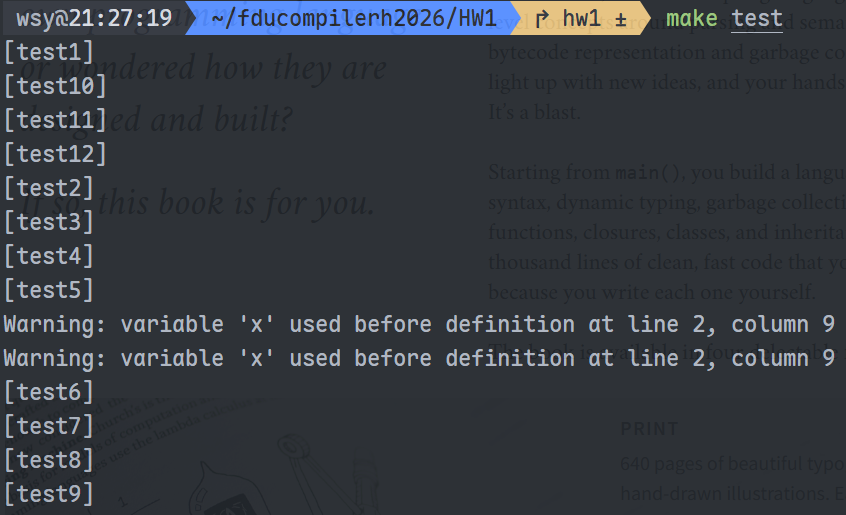

# HW1 实验报告

## 参考材料

去年看了这本书: Crafting Interpreters，正好这个第一次lab就相当于写一个解释器然后再稍微优化优化，所以就只参考了这本书。网站：https://craftinginterpreters.com/

## Constant Propagation

常量折叠分两步进行：

1. 先用`minusIntRewrite(root)`来把负数直接算出来。
2. 然后自底向上遍历 AST，当发现 `BinaryOp` 的左右子节点都是 `IntExp` 时，直接计算结果并替换为新的 `IntExp` 节点。

具体而言，实现了一个visitor：ConstantPropagator。
核心逻辑即为 BinaryOp 的 visit 方法：

```cpp
void ConstantPropagator::visit(BinaryOp *node) {
    node->left->accept(*this);
    Exp *l = static_cast<Exp *>(newNode);
    node->right->accept(*this);
    Exp *r = static_cast<Exp *>(newNode);

    if (l->getASTKind() == ASTKind::IntExp &&
        r->getASTKind() == ASTKind::IntExp) {
        int lval = static_cast<IntExp *>(l)->val;
        int rval = static_cast<IntExp *>(r)->val;
        newNode = new IntExp(node->getPos()->clone(), result);
        return;
    }
    newNode = new BinaryOp(node->getPos()->clone(), l, node->op->clone(), r);
}
```

此外，`UnaryOp` 的 visit 也处理了经过子树折叠后新产生的 `UnaryOp(-, IntExp)` 情况，确保 `(-(3+4))` 这类表达式也能被完全折叠为 `IntExp(-7)`。

## Executor

**实现思路**：

Executor 是一个解释执行的 Visitor，维护一个 `map<string, int>` 变量表和 `result` 作为当前节点的执行结果值。遍历过程中：

- Assign：求值右侧表达式，存入变量表
- Return：求值表达式，存入 `result` 
- BinaryOp：递归求值左右操作数，根据运算符计算，存入 `result`
- UnaryOp：递归求值操作数，取反，存入 `result`
- IdExp：查变量表。若变量未定义，假设值为 0，并在 stderr 报告位置（行号和列号）；最后将值存入 `result`
- IntExp：直接将整数值存入 `result`

## Git 提交记录

```
6353087 (HEAD -> hw1) HW1: fix executor to output only once via execute(cp)
7bf3337 HW1: executor prints at return; add .clang-format with 4-space indent + root Makefile format target
dac7417 HW1: add experiment report
2c23363 HW1: add extra test cases (test5-test12) for edge coverage
1abc8ab HW1: implement constantPropagation and executor, pass all 4 tests
d066116 (fj/hw1) chore: fixed .gitignore, added .github
```

## 测试结果

以下是测试结果：


以test1为示例：

```
public int main() {
	x = ((-1)+((-2)*3));
	return x;
}
```

常量折叠：

```xml
<?xml version="1.0" encoding="UTF-8"?>
<Program>
    <MainMethod>
        <StmList>
            <Assign>
                <IdExp id="x"/>
                <IntExp val="-7"/>
            </Assign>
            <Return>
                <IdExp id="x"/>
            </Return>
        </StmList>
    </MainMethod>
</Program>
```

解释器执行：

```
-7
```

